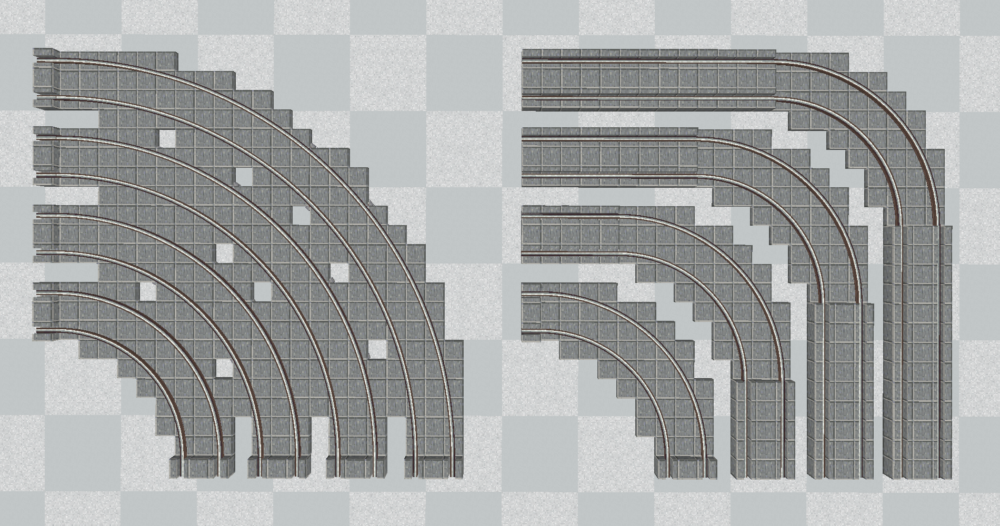
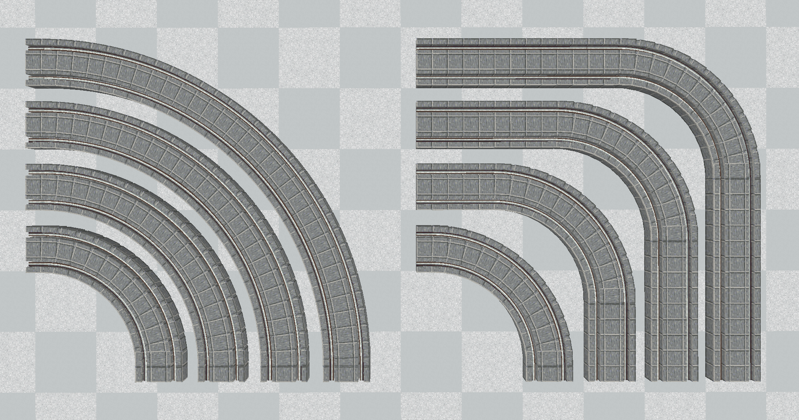
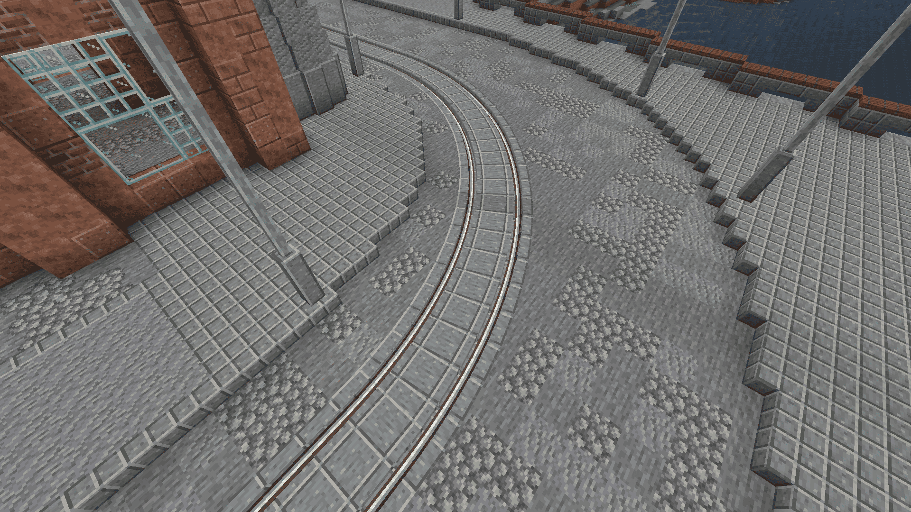

# Create: Curve Casing Fix

**Better-looking curved tram tracks for Create: Steam 'n' Rails.**

<i>I was really annoyed by how the tracks looked on curves. The original mod didn't fill curved tracks with slabs.</i>

## 📋 About

Flat curves normally use thin 3px panels for their casing, which makes them look different from straight cased tracks.

**Create: Curve Casing Fix** adds full slab-style casing to flat curved tracks, matching the casing on straight tracks and adding the same rail grooves.

---

### **Before**

---

### **After**

---

### **Tram track showcase**

🚋 <i>Now you can make proper tram tracks!</i>

> **⚠️ Known Issues**  
> Narrow gauge tracks may still look bad on curves.

> **ℹ️ Important**  
> This is a **client-side visual fix** and does not add new blocks, items, or gameplay mechanics.

## 📦 Requires

- [Create](https://modrinth.com/mod/create)
- [Create: Steam 'n' Rails](https://modrinth.com/mod/create-steam-n-rails)
